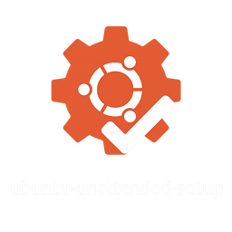

# 配置文件使用指南

## 📋 目录
- [快速开始](#快速开始)
- [配置文件说明](#配置文件说明)
- [安全检查清单](#安全检查清单)
- [常见问题](#常见问题)

---

## 🚀 快速开始

### 1. 创建真实配置文件

```bash
# 复制模板文件
cp config.ini.example config.ini
cp host.ini.example host.ini
```

### 2. 生成强密码

```bash
# 生成 Aria2 RPC 密钥
openssl rand -base64 32

# 或使用 pwgen（需先安装：sudo apt install pwgen）
pwgen -s 32 1
```

### 3. 编辑配置文件

```bash
# 使用你喜欢的编辑器
vim config.ini
# 或
nano config.ini
```

**必须修改的配置项：**

```ini
# config.ini 中需要修改：
[Aria2]
ARIA2_RPC_SECRET = YOUR_RPC_SECRET_HERE  # 替换为步骤2生成的密码

[NextCloud]
NEXTCLOUD_SERVER = YOUR_NEXTCLOUD_SERVER_HERE  # 你的 NextCloud 服务器地址

[OpenVPN]
OPENVPN_PROFILE_NAME = YOUR_VPN_PROFILE_NAME_HERE  # VPN 配置文件名
OPENVPN_SERVER = YOUR_VPN_SERVER_HERE  # VPN 服务器地址
```

### 4. 验证配置

```bash
# 检查是否还有未替换的占位符
grep -r "YOUR_.*_HERE" config.ini

# 如果有输出，说明还有配置未完成
# 如果无输出，说明配置完成
```

### 5. 确认 .gitignore 生效

```bash
# 检查 config.ini 是否被 Git 忽略
git status

# 应该看不到 config.ini 和 host.ini
# 只能看到 config.ini.example 和 host.ini.example
```

---

## 📚 配置文件说明

### config.ini 结构

#### [System] - 系统配置
```ini
TIMEZONE = America/Vancouver     # 时区（timedatectl list-timezones 查看）
LOCALE = en_US.UTF-8            # 语言
JAVA_PACKAGE = openjdk-21-jre   # Java 版本
REMOVE_SNAP = True              # 是否移除 Snap
CONFIGURE_SUDO_NOPASSWD = True  # 是否配置 sudo 免密
```

#### [Aria2] - 下载工具
```ini
ARIA2_RPC_SECRET = xxx          # RPC 密钥（必须修改）
ARIA2_RPC_PORT = 6800           # RPC 端口
HTTP_USER =                     # HTTP 认证用户名（可选）
HTTP_PASSWD =                   # HTTP 认证密码（可选）
```

#### [NextCloud] - 云同步
```ini
NEXTCLOUD_VERSION = 4.0.3       # 客户端版本
NEXTCLOUD_SERVER = xxx          # 服务器地址（必须修改）
```

#### [OpenVPN] - VPN 客户端
```ini
OPENVPN_PROFILE_NAME = xxx      # 配置文件名（必须修改）
OPENVPN_SERVER = xxx            # 服务器地址（必须修改）
OPENVPN_PORT = 1194             # 端口
```

### host.ini 结构

#### [HOSTS] - 自定义域名解析
```ini
# 加速访问（解决 DNS 污染）
github.com = 140.82.113.4
google.com = 142.250.185.206
```

#### [BLOCKLIST] - 广告屏蔽
```ini
# 将广告域名解析到 127.0.0.1
baidustatic.com = 127.0.0.1
google-analytics.com = 127.0.0.1
```

---

## 🔒 安全检查清单

### 提交代码前必须检查

- [ ] **config.ini 不在 Git 版本控制中**
  ```bash
  git ls-files | grep config.ini
  # 应该无输出
  ```

- [ ] **密码已使用强随机密码**
  ```bash
  # 检查密码长度（至少 32 字符）
  grep "ARIA2_RPC_SECRET" config.ini | wc -c
  ```

- [ ] **.example 文件不包含真实密码**
  ```bash
  grep -i "password\|secret" config.ini.example
  # 应该只看到 YOUR_*_HERE 占位符
  ```

- [ ] **敏感配置已备份**
  ```bash
  cp config.ini ~/Backup/config.ini.backup
  cp host.ini ~/Backup/host.ini.backup
  ```

### Git 历史检查

```bash
# 检查是否曾经提交过敏感文件
git log --all --full-history --source -- config.ini

# 检查是否包含密码
git log --all -p -S "YOUR_PASSWORD"

# 搜索所有密码相关内容
git grep -i password
git grep -i secret
git grep -i token
```

### 清理 Git 历史（如果发现敏感信息）

```bash
# 方法 1: 使用 git filter-branch
git filter-branch --force --index-filter \
  "git rm --cached --ignore-unmatch config.ini" \
  --prune-empty --tag-name-filter cat -- --all

# 方法 2: 使用 BFG Repo-Cleaner（推荐，更快）
# 下载：https://rtyley.github.io/bfg-repo-cleaner/
java -jar bfg.jar --delete-files config.ini
git reflog expire --expire=now --all
git gc --prune=now --aggressive

# 强制推送（会覆盖远程仓库）
git push origin --force --all
git push origin --force --tags
```

---

## ❓ 常见问题

### Q1: 如何更新软件版本？

**A:** 编辑 `config.ini`，修改对应的 `VERSION` 字段：

```ini
# 例如更新 NextCloud
[NextCloud]
NEXTCLOUD_VERSION = 4.1.0  # 修改为新版本号
```

然后重新运行安装脚本：
```bash
./setup.sh
# 选择对应的模块重新安装
```

### Q2: Aria2 RPC 连接失败？

**A:** 检查以下几点：

1. **确认服务运行**
   ```bash
   systemctl --user status aria2c
   ```

2. **检查端口**
   ```bash
   netstat -tlnp | grep 6800
   ```

3. **验证密钥**
   ```bash
   grep "rpc-secret" ~/.config/aria2/aria2.conf
   ```

4. **测试连接**
   ```bash
   curl http://localhost:6800/jsonrpc \
     -H "Content-Type: application/json" \
     -d '{"jsonrpc":"2.0","method":"aria2.getVersion","id":"1","params":["token:YOUR_SECRET"]}'
   ```

### Q3: hosts 屏蔽导致网站无法访问？

**A:** 临时禁用某个域名屏蔽：

1. **编辑 host.ini**
   ```bash
   vim host.ini
   ```

2. **注释掉可疑行**
   ```ini
   # google-analytics.com = 127.0.0.1  # 临时禁用
   ```

3. **重新运行系统配置**
   ```bash
   ./setup.sh
   # 选择 00_system.sh
   ```

4. **刷新 DNS 缓存**
   ```bash
   sudo systemd-resolve --flush-caches
   ```

### Q4: 如何完全卸载？

**A:** 
```bash
# 1. 停止所有服务
systemctl --user stop aria2c

# 2. 删除安装的程序
rm -rf ~/Programs/*

# 3. 删除配置文件
rm -rf ~/.config/aria2
rm -rf ~/.config/ibus/rime

# 4. 恢复原始 hosts 文件
sudo cp /etc/hosts.backup.<timestamp> /etc/hosts

# 5. 删除 sudo 免密配置
sudo rm /etc/sudoers.d/$USER
```

### Q5: 模板文件被意外修改了怎么办？

**A:** 从 Git 仓库恢复：
```bash
# 恢复单个文件
git checkout config.ini.example

# 恢复所有模板文件
git checkout *.example
```

### Q6: 如何在多台机器上使用相同配置？

**A:** 
1. **导出配置（排除敏感信息）**
   ```bash
   # 创建配置备份
   cp config.ini config.ini.shared
   
   # 移除敏感字段
   sed -i 's/ARIA2_RPC_SECRET = .*/ARIA2_RPC_SECRET = YOUR_RPC_SECRET_HERE/' config.ini.shared
   ```

2. **在新机器上使用**
   ```bash
   # 复制备份配置
   cp config.ini.shared config.ini
   
   # 重新生成密钥
   openssl rand -base64 32
   
   # 编辑配置填入新密钥
   vim config.ini
   ```

### Q7: 如何验证配置是否正确？

**A:** 使用验证脚本（创建为 `validate_config.sh`）：

```bash
#!/bin/bash
# validate_config.sh - 配置验证脚本

echo "🔍 验证配置文件..."

# 检查必需文件
if [ ! -f "config.ini" ]; then
    echo "❌ 未找到 config.ini"
    exit 1
fi

# 检查占位符
PLACEHOLDERS=$(grep -r "YOUR_.*_HERE" config.ini)
if [ -n "$PLACEHOLDERS" ]; then
    echo "⚠️  发现未替换的占位符："
    echo "$PLACEHOLDERS"
    exit 1
fi

# 检查密码强度（至少 20 字符）
RPC_SECRET=$(grep "ARIA2_RPC_SECRET" config.ini | cut -d'=' -f2 | tr -d ' ')
if [ ${#RPC_SECRET} -lt 20 ]; then
    echo "⚠️  RPC 密钥过短（至少 20 字符）"
    exit 1
fi

echo "✅ 配置验证通过！"
```

运行验证：
```bash
chmod +x validate_config.sh
./validate_config.sh
```

---

## 🔗 相关链接

- [主项目 README](README.md)
- [.gitignore 说明](.gitignore)
- [模板文件目录](templates/)
- [安装模块目录](modules/)

---

## 📞 获取帮助

如果遇到问题：

1. **查看日志**
   ```bash
   journalctl --user -xe
   ```

2. **检查语法**
   ```bash
   bash -n setup.sh  # 检查脚本语法
   ```

3. **启用调试模式**
   ```bash
   bash -x setup.sh  # 显示执行过程
   ```

4. **提交 Issue**
   - 提供错误信息
   - 说明操作系统版本
   - 附上相关日志（移除敏感信息）

---

**最后更新：2024-12**
